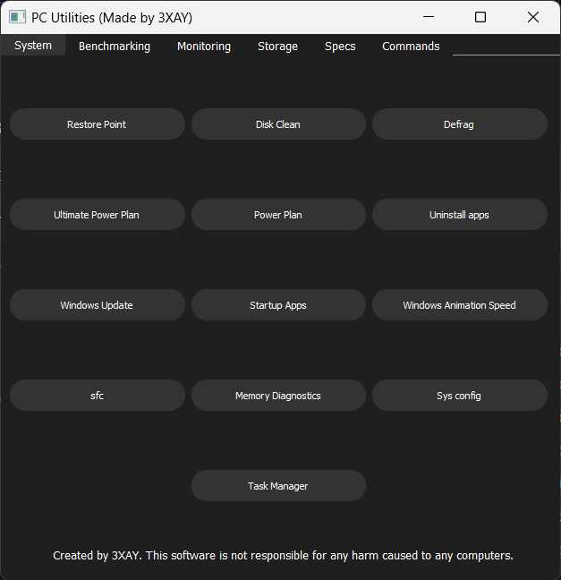

# PC Utilities

This is a fully python-based application. This is meant to be fully portable, as long as you have a few portable apps in the same folder as this application. This can be used to do regular maintenance on Windows 10/11 PCs and benchmark them. This software has been tested on Windows 11 and a fresh install of Windows 10.
The purpose of this app is to allow you to open apps / menus required for maintainance and benchmarking easily. __It's an app-launcher for people who want to maintain their Windows machines easily.__

[Demo link](https://cloud-eosrtjuvn-hack-club-bot.vercel.app/0demov1-5.mp4)

## Required files

As of now, you only need Cinebench, FurMark, HWInfo, CrystalDiskInfo, and CrystalDiskMark.

Cinebench can be obtained by downloading it from [the website](https://www.maxon.net/en/downloads/cinebench-2024-downloads?srsltid=AfmBOopoX9mBynlP9FzDjcrhMgEaBfg7Z1weI43GJGz_idve4LX2x146).
 Extract the .ZIP file, you'll need the extracted folder later.

Furmark can be obtained by [going to the website](https://geeks3d.com/furmark/downloads/) and downloading the latest version as a .ZIP file.
 Extract the .ZIP file and then take the folder inside the extracted folder and save that, you'll need it later.

HWInfo can be obtained by going to [the website](https://www.hwinfo.com/download/) and downloading the portable version.
 Extract the .ZIP file and save the extracted folder for later. You can also delete the `HWiNFO_ARM64.exe` and `HWiNFO_32.exe` files if you want to save space.

CrystalDiskInfo can be obtained from [PortableApps.com](https://portableapps.com/apps/utilities/crystaldiskinfo_portable)
 Open the downloaded .EXE file and go through the setup. Save the folder that was created for later.

CrystalDiskMark can be obtained from [PortableApps.com](https://portableapps.com/apps/utilities/crystaldiskmark_portable)
 Open the downloaded .EXE file and go through the setup. Save the folder that was created for later.

## File structure

Move all of the folders that were created into a new folder. Move the `PC-Utilities.exe` file there as well.

Cinebench must be placed in a folder named **'CinebenchPortable'**. Simply rename the extracted folder from before.
Open the folder and ensure that the application inside is named **'Cinebench.exe'**

FurMark must be placed in a folder named **'FurMarkPortable'**. Simply rename the extracted folder from before.
Open the folder and ensure that the application inside is named **'FurMark2.exe'** (Rename the `FurMark_GUI.exe` file to `FurMark2.exe`)

HWInfo must be placed in a folder named **'HardwareInfoPortable'**. Simply rename the extracted folder from before.
Open the folder and ensure that the application inside is named **'HWiNFO64.exe'**

CrystalDiskInfo must be placed in a folder named **'CrystalDiskInfoPortable'**. (This should be done for you)
Ensure that the application inside is named **'CrystalDiskInfoPortable.exe'** (This should be done for you)

CrystalDiskMark must be placed in a folder named **'CrystalDiskMarkPortable'** (This should be done for you)
Ensure that the application inside is named **'CrystalDiskMark.exe'** (This should be done for you)

Below is an example of the file structure:

## Helpful tips
Make sure to run the application with administrator privileges. This will allow everything to work properly.  
If you are unsure on how to do something, **do not** attempt to do it.  
The application can be slow to launch on some computers, be patient.  
Some buttons may take some time to actually open up an application (especially Cinebench), be patient.  
Are you confused about the purpose of some buttons? Check out the [wiki](https://github.com/3XAY/PC-Utilities/wiki)!  
Any questions? Create a [discussion](https://github.com/3XAY/PC-Utilities/discussions)!

## Warning
I, 3XAY, am not responsible for any harm caused by this software. By using this software, you are agreeing to this warning. You should read the code to understand what is happening when you click the buttons. This software currently only gives you steps and opens the required applications to complete those steps. Failure to properly follow those steps could result in harm caused to your computer.
